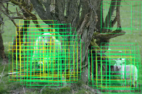
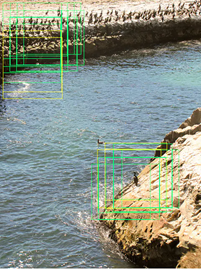
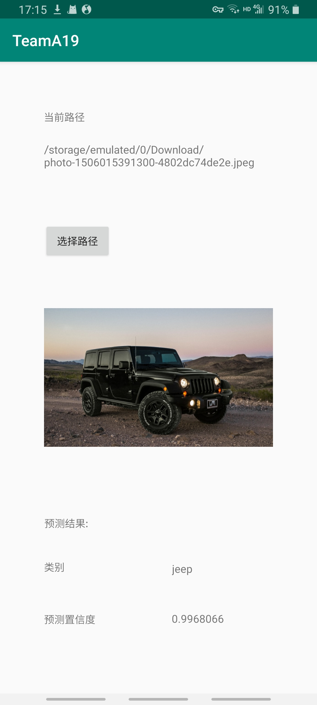

> ❀有重开日

Hi，我是何玉峰
同济大学20届计算机科学与技术系信息安全专业本科毕业生。

目前想要在上海或者北京找一份c++/python 后端或者cv相关的工作，如果有意向合作请联系 neondream@foxmail.com 或者微信号:neonplanet
希望合作愉快( •̀ ω •́ )y

####参与的项目
##### [1]:Mask R-CNN
MRCNN中FPN+RPN网络的复现，以及后续网络的搭建
并尝试在windows下使用pytorch+Libtorch+cudac对计算过程进行优化

##### [2]:tensorflow 下实现风格迁移

##### [3]:安卓图像识别app开发 [详情](https://github.com/hateusername/mobilenet-android-app)

##### [4]:分布式 lab
 待更新
##### [5]:https server
 待更新

####校园经历
参与IEEE第9届效用与云计算会议，第三届IEEE/ACM大数据科学工程与应用大会等各类国际会议，并能够与会议学者使用英语流利讨论

####技能/证书/爱好等
1. c++，python，能够阅读源码，参与开发，理解数据结构与算法
2. 计算机网络对数据链路层，网络层，传输层，及应用层都有基本了解，了解各数据协议基本原理
3. 英语CET-6，能够与国际会议学者流利讨论问题
4. 能够使用github进行开发
5. 爱好：复古波制作，守望先锋（曾达到国服前500）

####个人总结
具有较强的自学能力，能够自己解决开发过程中遇见的问题
较强的沟通理解能力，能够迅速理解并掌握开发中的原理
团队协作能力，能够快速融入团队并共同协作
乐观积极，幽默有趣XD
