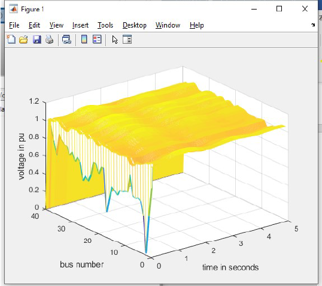

> ❀有重开日

Hi，我是何玉峰，北京大学21级软件工程实验班研究生

## 目前在干什么

目前在北京大学计算语言学研究所，研究兴趣在视觉与语言交叉的领域

但是没有paper qwq，cv一知半解，nlp刚刚入门hhh

加油捏

## 工作经历

[Caper](https://www.caper.ai)

2021年 计算机视觉工程师 上海

他们在创造令人惊叹的产品！！！( •̀ ω •́ )y

## 参与的项目

##### [1]:Mask R-CNN（c++ python cudac pytorch Libtorch）

1. FPN+RPN网络的实现

2. 以及后续网络的搭建

3. 尝试在windows下使用pytorch+Libtorch+cudaC实现RoIAlign并加速计算过程
    
   
   

##### [2]:tensorflow 下实现风格迁移(python tensorflow)

 

##### [3]:毕业设计，基于CNN的电网异常定位研究（matlab，python，pytorch）

1. 使用matlab生成电路仿真数据

2. 修改第三方工具箱power system toolbox源码用于生成中间数据

3. 搭建CNN用于定位电网故障位置
   
   

#### 校园经历

参与IEEE第9届效用与云计算会议，第三届IEEE/ACM大数据科学工程与应用大会等各类国际会议，并能够与会议学者使用英语流利讨论

#### 技能/证书/爱好等

1. 能够全英文环境下完成工作
2. 爱好：复古波制作，守望先锋（曾达到国服前500）
3. 曾参与美国技术专利申请书撰写

#### 个人总结

具有较强的自学能力，能够自己解决开发过程中遇见的问题 
较强的沟通理解能力，能够迅速理解并掌握开发中的原理 
团队协作能力，能够快速融入团队并共同协作 
乐观积极，幽默有趣XD
